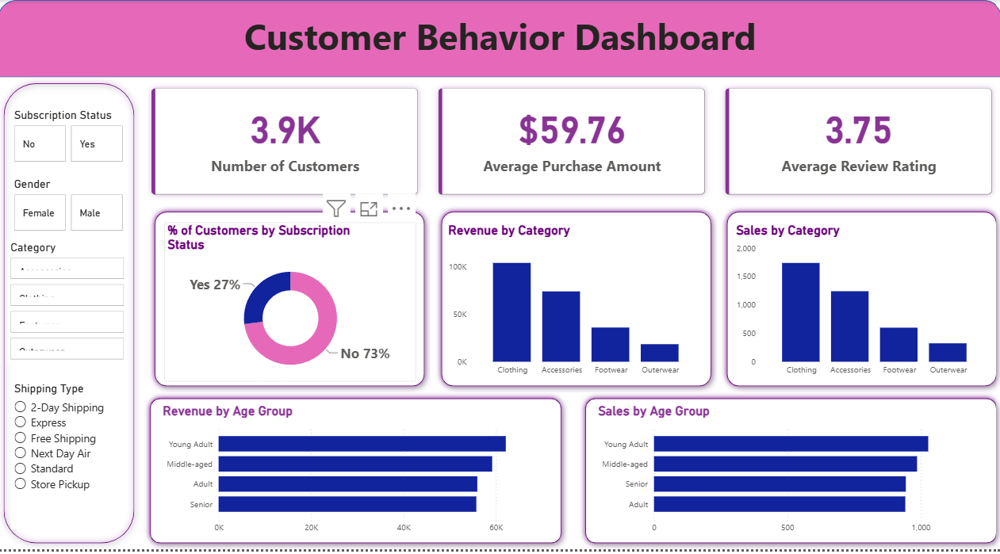

# 🛍️ Customer Shopping Behavior Analysis — SQL (MySQL) + Python + Power BI

An end-to-end **data analytics portfolio project** built to analyze retail customer shopping trends and deliver actionable business insights across **customer segments, purchase behavior, revenue, and loyalty**.
This project focuses on the full analyst workflow — data cleaning, SQL-based business analysis, and professional dashboard design.
---

## ℹ️ About This Project

This is an end-to-end data analytics project that walks through the complete lifecycle of a real-world analyst deliverable — from raw data to a polished business dashboard. It was built as a hands-on way to practice the core analyst toolkit (Python, SQL, and Power BI) on a retail customer dataset, while adapting the original tutorial's database layer from PostgreSQL to **MySQL**.

The project is intended as a **portfolio piece** to demonstrate practical, job-ready skills in data cleaning, business-oriented SQL querying, and dashboard storytelling for non-technical stakeholders.

---

## 📌 Project Overview

Retailers generate large volumes of transactional data every day. Turning this raw data into **meaningful insights** requires a structured, end-to-end analytics workflow — from cleaning and preparing the data, to querying it for business answers, to visualizing it for stakeholders.

This project addresses key business questions related to **customer segmentation, purchase drivers, loyalty, and category/seasonal trends** using Python, MySQL, and Power BI.

---

## 🎯 Business Objectives

- Understand overall customer purchasing patterns and revenue contribution
- Identify high-value customer segments and repeat-purchase behavior
- Analyze category, seasonal, and discount-driven purchase trends
- Understand the relationship between demographics and spending
- Enable data-driven marketing and retention decisions

---

## 📂 Dataset Overview

The dataset contains **3,900 transactions across 18 columns**, with 37 missing values in the Review Rating column (imputed using the median rating per product category). It represents **customer-level retail transaction data** and includes:

- Customer demographics (age, gender, location)
- Purchase details (category, item, purchase amount)
- Purchase frequency and subscription status
- Discount and promo code usage
- Payment method and shipping type
- Review ratings

Data is analyzed at the **customer, category, and time-period** level to identify trends and patterns.

---

## 🧱 Project Architecture

The project follows a three-stage analytical pipeline, each serving a specific purpose:

1. **Data Preparation & EDA (Python)** — clean and explore the raw dataset
2. **Business Analysis (MySQL)** — query the cleaned data to answer business questions
3. **Visualization (Power BI)** — present findings through an interactive dashboard

---

## 🔍 Stage-wise Business Explanation

---

### 1️⃣ Data Preparation & EDA — Python

**Purpose**
- Import and clean the raw `customer_shopping_behavior.csv` dataset
- Handle missing values, standardize formats, and engineer features for analysis
- Perform exploratory data analysis to understand distributions and outliers
- Load the cleaned dataset into a MySQL database for querying

**Notebook:** `Customer_Shopping_Behavior_Analysis.ipynb`

**Business Value**
- Ensures downstream SQL and Power BI analysis is based on clean, reliable data

---

### 2️⃣ Business Analysis — MySQL

**Purpose**
Answer 10 structured business questions using SQL against the cleaned dataset loaded into MySQL.

**Key Findings**

| # | Question | Result |
|---|---|---|
| 1 | Revenue by gender | Male customers generated **$157,890** vs. **$75,191** from female customers — more than 2x |
| 2 | High-spending discount users | **839 customers** used a discount and still spent above the average purchase amount |
| 3 | Top 5 products by rating | Gloves (3.86), Sandals (3.84), Boots (3.82), Hat (3.80), Skirt (3.78) |
| 4 | Standard vs. Express shipping | Express orders average **$60.48** vs. **$58.46** for Standard — a ~3.5% premium |
| 5 | Subscribers vs. non-subscribers | Non-subscribers (2,847 customers) generate **$170,436** in total revenue vs. **$62,645** from subscribers (1,053) — despite similar avg. spend (~$59–60) |
| 6 | Most discount-dependent products | Hat (50.0%), Sneakers (49.7%), Coat (49.1%), Sweater (48.2%), Pants (47.4%) of purchases involved a discount |
| 7 | Customer segmentation | **3,116 Loyal**, **701 Returning**, **83 New** customers — the base is heavily repeat-purchase driven |
| 8 | Top 3 products per category | Clothing: Blouse, Pants, Shirt · Accessories: Jewelry, Sunglasses, Belt · Footwear: Sandals, Shoes, Sneakers · Outerwear: Jacket, Coat |
| 9 | Repeat buyers (>5 purchases) & subscription | **958** repeat buyers are subscribed vs. **2,518** who aren't — high-frequency buyers aren't converting to subscriptions |
| 10 | Revenue by age group | Young Adult ($62,143) > Middle-aged ($59,197) > Adult ($55,978) > Senior ($55,763) — fairly evenly spread, slight skew toward younger shoppers |

**File:** `customer_behavior_sql_queries.sql`

**Business Value**
- Quantifies exactly where revenue, loyalty, and discount dependency concentrate — the numbers behind every dashboard visual

---

### 3️⃣ Visualization — Power BI

**Purpose**
Present the analysis as an interactive "Customer Behavior Dashboard" for stakeholders.

**Key Metrics Displayed**
- **3.9K** total customers, **$59.76** average purchase amount, **3.75** average review rating
- Subscription split: **27% subscribed vs. 73% not subscribed**
- Revenue and sales by category (Clothing leads, followed by Accessories, Footwear, Outerwear)
- Revenue and sales by age group (Young Adult segment leads)
- Interactive filters/slicers: Subscription Status, Gender, Category, Shipping Type

**File:** `customer_behavior_dashboard.pbix`

**Business Value**
- Lets stakeholders slice revenue and customer behavior by segment in real time, without needing to write SQL

* *

---

## 🛠 Tools & Technologies Used

- **Python** (Pandas, NumPy, Matplotlib/Seaborn) — data cleaning & EDA
- **MySQL** — data storage & business-question queries
- **Microsoft Power BI** — dashboard design & DAX calculations
- Data Modeling & Relationships
- KPI Design & Dashboard UX Principles

---

## 📈 Business Impact & Recommendations

Based on the analysis, the following data-backed recommendations were identified:

- **Boost subscriptions** — Non-subscribers already generate ~73% of revenue ($170K of $233K total); converting even a fraction of them, especially the 2,518 repeat buyers not yet subscribed, represents a clear untapped revenue lever
- **Build loyalty programs** — With 3,116 of ~3,900 customers already "Loyal," reward repeat buyers to protect this base and convert the 701 "Returning" customers further up the loyalty curve
- **Review discount policy** — Products like Hats and Sneakers see ~50% of purchases discounted; balance the sales lift against margin erosion on these SKUs
- **Double down on top-rated products** — Gloves, Sandals, Boots, Hat, and Skirt (all rated 3.78+) are strong candidates for featured placement and campaigns
- **Target high-revenue segments** — Male customers (2x female revenue) and the Young Adult age group are the highest-revenue segments; prioritize marketing spend accordingly, while exploring why female and Senior segments under-index

---

## 📚 Key Learnings

- End-to-end analytics workflow: Python → SQL → Power BI
- Writing business-oriented SQL queries (joins, aggregations, window functions)
- Migrating a project's database layer from PostgreSQL to MySQL
- Data storytelling and dashboard design for non-technical stakeholders

---

## 🚀 Future Enhancements

- Real-time / scheduled data refresh
- Customer churn prediction
- RFM (Recency, Frequency, Monetary) segmentation
- Predictive sales forecasting

---

## 📂 Repository Structure

```
├── Customer_Shopping_Behavior_Analysis.ipynb   # Data import, cleaning, EDA, MySQL connection
├── customer_behavior_sql_queries.sql           # Business-question SQL queries (MySQL)
├── customer_behavior_dashboard.pbix            # Power BI interactive dashboard
├── customer_shopping_behavior.csv              # Raw dataset
├── Business Problem Document.pdf               # Problem statement & objectives
├── Customer Shopping Behavior Analysis.pdf     # Final written report
├── Customer-Shopping-Behavior-Analysis.pptx    # Stakeholder presentation deck
└── LICENSE
```

---

## 👤 Author

**Saksham**
Aspiring Data Analyst | SQL · Python · Power BI

---

## 📎 Note

This project is created for **learning, portfolio, and demonstration purposes**, adapted from an existing tutorial with the database layer rebuilt in MySQL.

## 🙌 Credits

This project follows the structure and methodology taught by **Amlan Mohanty** in the [original tutorial and repository](https://github.com/amlanmohanty1/customer-trends-data-analysis-SQL-Python-PowerBI).

## 📜 License

MIT — see [LICENSE](LICENSE) for details.
